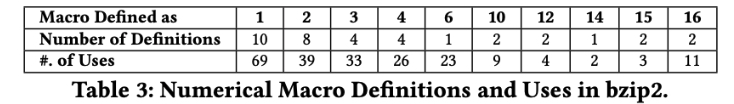
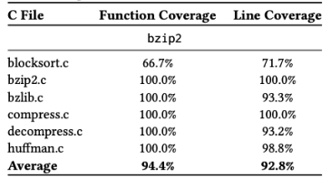
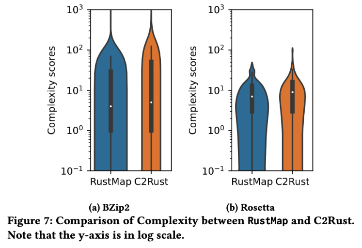
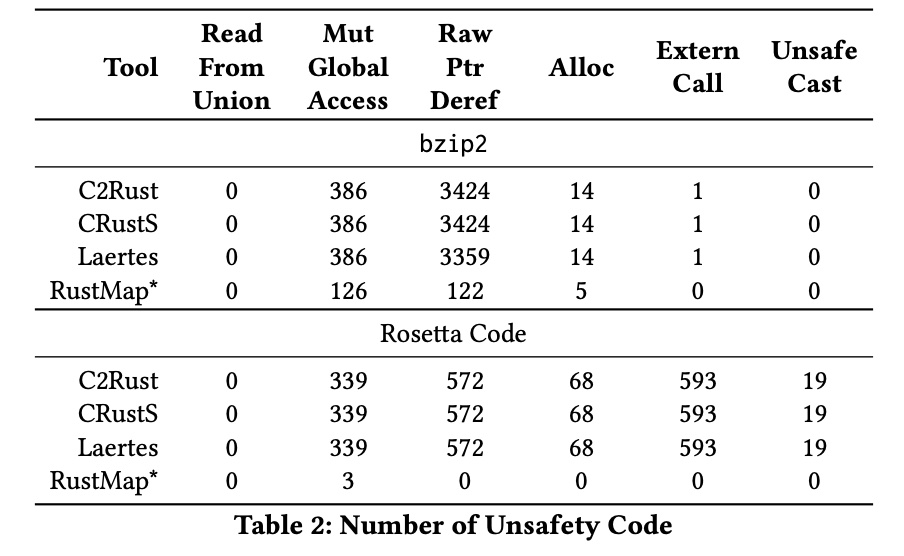

- [1. Introducation](#1-introducation)
  - [1.1. version introduction](#11-version-introduction)
- [2.  Scaffolding Boilerplate Generation (example of bzip2)](#2--scaffolding-boilerplate-generation-example-of-bzip2)
  - [2.1. Step 0: Preparation for Scaffolding](#21-step-0-preparation-for-scaffolding)
  - [2.2. Step 1: add save preprocessed file \*.i during `make`](#22-step-1-add-save-preprocessed-file-i-during-make)
    - [2.2.1. Remove directives from \*.i](#221-remove-directives-from-i)
    - [2.2.2.  Rename `bzip2recover.i` to `bzip2recover.i.bk`](#222--rename-bzip2recoveri-to-bzip2recoveribk)
  - [2.3.  Dynamically applied Runtime Function Call Graph](#23--dynamically-applied-runtime-function-call-graph)
  - [2.4. Generate Function Static Call Graph](#24-generate-function-static-call-graph)
    - [2.4.1. Use Static cflow](#241-use-static-cflow)
    - [2.4.2. Step 4: Generate RustMap Scaffolding](#242-step-4-generate-rustmap-scaffolding)
- [3. Prompts](#3-prompts)
  - [3.1. Prompt for directly applying LLM to translate](#31-prompt-for-directly-applying-llm-to-translate)
  - [3.2. Prompt to Resolve Compilation Error](#32-prompt-to-resolve-compilation-error)
  - [3.3. Prompt to resolve Inconsistency error.](#33-prompt-to-resolve-inconsistency-error)
- [4. Functional Test](#4-functional-test)
  - [4.1. Functional Test of bzip2](#41-functional-test-of-bzip2)
    - [4.1.1. bzip2 executable binary generation](#411-bzip2-executable-binary-generation)
    - [4.1.2. test cases generations bzip2](#412-test-cases-generations-bzip2)
    - [4.1.3. Functional Test compress small-files](#413-functional-test-compress-small-files)
    - [4.1.4. Verification of RustMap bzip2 compress by uncompressing `.bz2`](#414-verification-of-rustmap-bzip2-compress-by-uncompressing-bz2)
  - [4.2. Functional Test of Rosetta Code](#42-functional-test-of-rosetta-code)
    - [4.2.1. Batch Execution of Rosetta Code](#421-batch-execution-of-rosetta-code)
    - [4.2.2. Verification of Rosetta running result compared to original C](#422-verification-of-rosetta-running-result-compared-to-original-c)
- [5. Count of Macros Definition and Usage](#5-count-of-macros-definition-and-usage)
- [6. Coverage Test](#6-coverage-test)
  - [6.1. Table 1.1: Calculating Coverage Test Ratio of Custom Test Case to bzip2 Test Suite](#61-table-11-calculating-coverage-test-ratio-of-custom-test-case-to-bzip2-test-suite)
    - [6.1.1. Measuring Coverage for bzip2's Original Test Suite](#611-measuring-coverage-for-bzip2s-original-test-suite)
    - [6.1.2. Measuring Coverage for Custom Test Suite: bzip2 Rust Compress and Decompress Functions](#612-measuring-coverage-for-custom-test-suite-bzip2-rust-compress-and-decompress-functions)
    - [6.1.3. Measuring Coverage for Custom Test Suite: bzip2 Rust Decompress Function](#613-measuring-coverage-for-custom-test-suite-bzip2-rust-decompress-function)
    - [6.1.4. Combined Coverage Results for bzip2](#614-combined-coverage-results-for-bzip2)
  - [6.2. Table 1.2 Rosetta Coverage Test Generation](#62-table-12-rosetta-coverage-test-generation)
- [7. Cogntive Complexity Test](#7-cogntive-complexity-test)
  - [7.1. bzip2 Complexity Test](#71-bzip2-complexity-test)
  - [7.2. Rosetta Code Complexity Test](#72-rosetta-code-complexity-test)
    - [7.2.1. Drawing Violin Graph for both bzip2 and Rosetta code](#721-drawing-violin-graph-for-both-bzip2-and-rosetta-code)
      - [7.2.1.1. How to Execute:](#7211-how-to-execute)
- [8. Unsafety Analysis for bzip2-rustmap-gpt and Rosetta-rustmap-gpt](#8-unsafety-analysis-for-bzip2-rustmap-gpt-and-rosetta-rustmap-gpt)
    - [8.0.1. Bzip2 unsafety categorization](#801-bzip2-unsafety-categorization)
- [9. Code Rewrite Pattern Samples](#9-code-rewrite-pattern-samples)
  - [9.1. Global Variable Lazy Static](#91-global-variable-lazy-static)
  - [9.2. Pointer Aliasing without Endiness Concern](#92-pointer-aliasing-without-endiness-concern)
  - [9.3. Pointer Aliasing with Endiness Concern](#93-pointer-aliasing-with-endiness-concern)
    - [9.3.1. C Code Implementation:](#931-c-code-implementation)
    - [9.3.2. Rust Code Implementation:](#932-rust-code-implementation)
    - [9.3.3. Summary of Differences:](#933-summary-of-differences)
    - [9.3.4. Summary of Differences:](#934-summary-of-differences)
  - [9.4. Illustrate Necessity to rewrite Complex Macro and how to rewrite C `switch-case` to Rust `while match`](#94-illustrate-necessity-to-rewrite-complex-macro-and-how-to-rewrite-c-switch-case-to-rust-while-match)


# 1. Introducation
The purpose of this artifact is to reproduce the experimental results we achieved in the paper "RustMap: Towards Project-Scale C to Rust Migration via LLM."

We will demonstrate how to perform the Coverage Test, Complexity Test, Functionality Test of bzip2 and 125 Rosetta code, and the Unsafety Test.


## 1.1. version introduction
- [bzip2-1.0.8](https://gitlab.com/bzip2/bzip2/-/tree/bzip2-1.0.8?ref_type=tags)
- [rosetta code](https://rosettacode.org/)


#  2.  Scaffolding Boilerplate Generation (example of bzip2)

> The following operational instructions can be executed in the Docker image `rustmap-feasibility-study.tar.gz` available on [zenodo](https://zenodo.org/records/10433166). The operational code is present in both this repository and the Zenodo Docker image.
>

  
## 2.1. Step 0: Preparation for Scaffolding
copy c-code/bzip2 to scaffolding_test directory
```bash
cp -r c-code/bzip2 scaffolding_test/
```

## 2.2. Step 1: add save preprocessed file *.i during `make`   

```bash
cd scaffolding_test/bzip2
# replace Makefile with the one that can save temp files
cp -r Makefile-save-temps Makefile
```

### 2.2.1. Remove directives from *.i
 
```bash
for file in *.i; do awk '!/^#[ \t]*[0-9]+[ \t]+"/' "$file" > "${file}.tmp" && mv "${file}.tmp" "$file"; done

```

### 2.2.2.  Rename `bzip2recover.i` to `bzip2recover.i.bk`

Since we only focus on bzip2 executable binary, we need to exclude the bzip2recover.i
( Caveat: if the binary has more than one executable, we should exclude the unnecessary one )


   
## 2.3.  Dynamically applied Runtime Function Call Graph
As we write in paper, we try to run original C program and observe the calling relationship.


Add the -pg option to CFLAGS and LDFLAGS: This is used to enable Gprof profiling during compilation and linking.
We have added `-pg` flag to Makefile in `./bzip2-1.0.8/Makefile` this will help to generate 

1. in Makefile add -pg, this is used to enable Gprof profiling during compilation and linking.
```bash
CFLAGS=-Wall -Winline -O2 -g $(BIGFILES) -pg
LDFLAGS+= -pg
```
make sure the flag `-pg` in CFLAGS and LDFLAGS in `c-code/bzip2-1.0.8/Makefile`

2. Run the program to generate the `gmon.out` file
```bash
cd c-code/bzip2-1.0.8
make clean
make
./bzip2 -1 < sample1.ref > sample1.rb2
```

3. Generate the analysis report gprof.out using Gprof
```bash
gprof bzip2 gmon.out > gprof.out
```
4. Generate the Dynamic call graph `call_graph.png` using Gprof2Dot and dot:
```bash
sudo apt-get install gprof graphviz -y
python3 -m venv myenv
source myenv/bin/activate
python3 -m pip install gprof2dot 

gprof2dot -f prof gprof.out | dot -Tpng -o dynamic_call_graph.png

```

## 2.4. Generate Function Static Call Graph 


### 2.4.1. Use Static cflow

When using the cflow tool for a C project, it's generally recommended to have only one main function in the project. cflow is designed to analyze function call relationships in C programs and generates a call graph. If there are multiple main functions, cflow might face difficulties, as the main function typically serves as the entry point of a program. For projects with multiple main functions, like those containing independent sub-projects, you might need to run cflow separately for each part or adjust the project structure for effective analysis. In summary, having a single main function is the best practice for using cflow, unless you have specific needs and strategies to handle multiple instances. 
 
```bash
python3 cflow_generation.py /root/rustmap/bzip2-real-test
```


### 2.4.2. Step 4: Generate RustMap Scaffolding
```bash
python3 extract.py /root/rustmap/bzip2-real-test
```


# 3. Prompts
## 3.1. Prompt for directly applying LLM to translate
```bash

If the C code references other vital functions or structures, ask mefirst and wait for my provided input.(ASK ME first)Convert the given code to idiomatic Rust, keeping its function. Useminimal unsafe traits. Don't translate unknown variables or functions, and avoid assumptions.(ASK ME frst)

(1) If a variable inside the function is modified, add the mut specifier.
(2) Distinguish between mutable and immutable references by stor-ing intermediate values.
(3) If necessary, add lifetime annotations.
(4) Add clear comments for all numeric types and pay attention to type conversions, especially between usize and others.
(5) Be cautious of potential out-of-bound errors in the C code.
(6)Use the Rust standard library as much as possible.
(7)When performing arithmetic operations, be mindful of potentialoverflow or underflow.


(...Here is C Code to be translated...)


I must reiterate: if you encounter unfamiliar variables or functionsduring translation, you must ask me and wait for my provided inputbefore translating.(ASK ME FIRST)


```
## 3.2. Prompt to Resolve Compilation Error
Normally we will after our test generate compilation error, we will directly put the compilation error into ChatGPT-4
See the examples of compilation errors in the directory: `prompt_examples/compilation-errors` We have listed some of compilation from our RustMap Translation of Rosetta Code


## 3.3. Prompt to resolve Inconsistency error. 
 please generate Rust code fragment here to have
  consistent states as the C code above
```bash
// C code fragment with its before- and after-states:
{
    (before-state of C)
    (...Here is the C code fragment that have
        caused errors in the translated Rust...)
    (after-state of C)
}

// Rust code generation:
{
    (before-state in Rust)
    /** please generate Rust code fragment here to have
        consistent states as the C code above
      */
}
```
Please check the detailed Example in `./prompt_examples/inconsistency-solution`

# 4. Functional Test
## 4.1. Functional Test of bzip2
> The following operational instructions can be executed in the Docker image `rustmap-feasibility-study.tar.gz` available on [zenodo](https://zenodo.org/records/10433166). The operational code is present in both this repository and the Zenodo Docker image.
>
> 
### 4.1.1. bzip2 executable binary generation
```bash
cd /root/rustmap/feasibility_study/bzip2_rs_gpt
cargo build --release
```
It will generate executable binary in `/root/rustmap/feasibility_study/bzip2_rs_gpt/target/release/bzip2_rs_gpt` this path


### 4.1.2. test cases generations bzip2
```bash
cd /root/rustmap/feasibility_study/bzip2_tests
python3 random-test-case-generation.py
```
This step will generate five small-scale text files: `random_1_chars.txt`, `random_10_chars.txt`, `random_100_chars.txt`, `random_1000_chars.txt`, `random_5000_chars.txt`
Then we will use bzip2-rust binary to test the results.


### 4.1.3. Functional Test compress small-files
```bash
cd /root/rustmap/feasibility_study/bzip2_tests-finished-example

# compress test cases and record its processing time
{ echo "Running random_1_chars.txt"; time /root/rustmap/feasibility_study/bzip2_rs_gpt/target/debug/bzip2_rs_gpt random_1_chars.txt; echo; echo "Running random_10_chars.txt"; time /root/rustmap/feasibility_study/bzip2_rs_gpt/target/debug/bzip2_rs_gpt random_10_chars.txt; echo; echo "Running random_100_chars.txt"; time /root/rustmap/feasibility_study/bzip2_rs_gpt/target/debug/bzip2_rs_gpt random_100_chars.txt; echo; echo "Running random_1000_chars.txt"; time /root/rustmap/feasibility_study/bzip2_rs_gpt/target/debug/bzip2_rs_gpt random_1000_chars.txt; echo; echo "Running random_5000_chars.txt"; time /root/rustmap/feasibility_study/bzip2_rs_gpt/target/debug/bzip2_rs_gpt random_5000_chars.txt; echo; } 2>&1 | tee

mv *.bz2 compress_output_bz2_files/
```

you may will the generation time in here: /root/rustmap/feasibility_study/bzip2_tests/timings.txt


### 4.1.4. Verification of RustMap bzip2 compress by uncompressing `.bz2`
```bash
cd /root/rustmap/feasibility_study/bzip2_tests/compress_output_bz2_files
bzip2recover random_1_chars.txt.bz2
bzip2 -d rec00001random_1_chars.txt.bz2

bzip2recover random_10_chars.txt.bz2
bzip2 -d rec00001random_10_chars.txt.bz2

bzip2recover random_100_chars.txt.bz2
bzip2 -d rec00001random_100_chars.txt.bz2

bzip2recover random_1000_chars.txt.bz2
bzip2 -d rec00001random_1000_chars.txt.bz2

bzip2recover random_5000_chars.txt.bz2
bzip2 -d rec00001random_5000_chars.txt.bz2


# Perform diff comparison
diff random_1_chars.txt rec00001random_1_chars.txt > diff_random_1_chars.txt
diff random_10_chars.txt rec00001random_10_chars.txt > diff_random_10_chars.txt
diff random_100_chars.txt rec00001random_100_chars.txt > diff_random_100_chars.txt
diff random_1000_chars.txt rec00001random_1000_chars.txt > diff_random_1000_chars.txt
diff random_5000_chars.txt rec00001random_5000_chars.txt > diff_random_5000_chars.txt

# If the resultant diff is zero we did
```


## 4.2. Functional Test of Rosetta Code
### 4.2.1. Batch Execution of Rosetta Code
Since there are attached testcases in original Roseta Code, we will directly execute the translated Roseta Code and Compare the result with original C Roseta Code
```bash
bash ./c-code/Rosetta-125/Rosetta-125.sh > original_roseta_result.log
bash ./executable_binaries_test/Rosetta_code_gpt/125-Rosetta-code-gpt/125-Rosetta-rs.sh > rustmap_roseta_result.log
```

### 4.2.2. Verification of Rosetta running result compared to original C
```bash
diff original_roseta_result.log rustmap_roseta_result.log 
```


# 5. Count of Macros Definition and Usage

> The following operational instructions can be executed in the Docker image `rustmap-feasibility-study.tar.gz` available on [zenodo](https://zenodo.org/records/10433166). The operational code is present in both this repository and the Zenodo Docker image.
> 


We count the number of macros declaration and usage based on original bzip2 C, which located in `c-code/bzip2-1.0.8`


# 6. Coverage Test
We try to show the process to generate the Coverage Test Statistics in this section


> The following operational instructions can be executed in the Docker image `rustmap-feasibility-study.tar.gz` available on [zenodo](https://zenodo.org/records/10433166). The operational code is present in both this repository and the Zenodo Docker image.

## 6.1. Table 1.1: Calculating Coverage Test Ratio of Custom Test Case to bzip2 Test Suite
we have added `coverage` flags in `Makefile` under `c-code/bzip2-1.0.8



### 6.1.1. Measuring Coverage for bzip2's Original Test Suite
```bash
cd /root/rustmap/c-code/bzip2-1.0.8
# this command generate 
make 
```
View the result in `/root/rustmap/c-code/bzip2-1.0.8/out/bzip2-1.0.8/index.html` for Table 1 bzip2


### 6.1.2. Measuring Coverage for Custom Test Suite: bzip2 Rust Compress and Decompress Functions
```bash
make cleancoverage
./bzip2 -k testcases/compress_test.txt
lcov --capture --directory . --output-file compress_coverage.info
genhtml compress_coverage.info --output-directory compress_out
```
View the Result in `bzip2-1.0.8/compress_out/bzip2-1.0.8/index.html`

### 6.1.3. Measuring Coverage for Custom Test Suite: bzip2 Rust Decompress Function
```bash
make cleancoverage
./bzip2 -k -d testcases/decompress_test.txt.bz2
lcov --capture --directory . --output-file decompress_coverage.info
genhtml decompress_coverage.info --output-directory decompress_out
```
View the Result in `bzip2-1.0.8/decompress_out/bzip2-1.0.8/index.html`


### 6.1.4. Combined Coverage Results for bzip2
Once you combine the result, you use Original Test Suite to divide  
 combined get the result like below:
View the Combined  Result in `bzip2-1.0.8/compress_out/bzip2-1.0.8/index.html`


## 6.2. Table 1.2 Rosetta Coverage Test Generation
```bash
# This script iterates through all subdirectories in the current directory, compiles and runs the first C file found in each subdirectory, collects code coverage data, and finally generates an HTML coverage report.
bash /root/rustmap/c-code/Rosetta-125/gcc-Rosetta-code.sh
```
View the result in `/root/rustmap/c-code/Rosetta-125/coverage_report/index.html` for Table 1 Rosetta Code


# 7. Cogntive Complexity Test

> The following operational instructions can be executed in the Docker image `rustmap-feasibility-study.tar.gz` available on [zenodo](https://zenodo.org/records/10433166). The operational code is present in both this repository and the Zenodo Docker image.


## 7.1. bzip2 Complexity Test
```bash
# Generate Cognitivie Complexity comparative study result for Rustmap and C2Rust for each folder
cargo run -- /root/rustmap/cognitive-complex-test/src/comparision/bzip2

cargo run -- /root/rustmap/cognitive-complex-test/src/comparision/blocksort

cargo run -- /root/rustmap/cognitive-complex-test/src/comparision/bzlib

cargo run -- /root/rustmap/cognitive-complex-test/src/comparision/compress

cargo run -- /root/rustmap/cognitive-complex-test/src/comparision/decompress

cargo run -- /root/rustmap/cognitive-complex-test/src/comparision/huffman
```
View the initial result in `/root/rustmap/cognitive-complex-test/result/bzip2-complexity-init-result.csv`


We merge the result as image below


View Final Result after merge


## 7.2. Rosetta Code Complexity Test
In `cognitive-complex-test/src`

1. Generate RustMap Rosetta Code Complexity Result
```bash
# Rename `main-Rosetta-gpt` and replace it as `main.rs`
cargo run -- /root/rustmap/executable_binaries_test/Rosetta_code_gpt

```

2. Generate C2Rust Rosetta Code Complexity Result
```bash
#  Rename `main-Rosetta-c2rust` and replace it as `main.rs`
cargo run --  /root/rustmap/unsafety-analysis-for-rust/test-inputs/Rosetta-c2rust-readability
```


View the initial result in `/root/rustmap/cognitive-complex-test/result/Rosetta-complexity-init-result.csv`


View Final Result after merge
  


### 7.2.1. Drawing Violin Graph for both bzip2 and Rosetta code

This `.ipynb` file reads two CSV files containing complexity score data for RustMap and C2Rust, generates violin plots for these data, and performs statistical comparisons using the Wilcoxon test and Cliff's Delta test.

The first `Book1.csv` contains complexity scores for bzip2 RustMap and C2Rust. The second `Book2.csv` contains complexity scores for Rosetta Code RustMap and C2Rust.

#### 7.2.1.1. How to Execute:

1. Ensure that Jupyter Notebook is installed. If not, install it using the following command:

```bash
pip install notebook
```


2. Open a terminal or command prompt and navigate to the directory containing the violin_plot.ipynb file. For example:

```bash
/root/rustmap/violin_plot.ipynb
```

3. Start Jupyter Notebook
```bash
jupyter notebook
```

4. The Jupyter Notebook interface will automatically open in your browser. Find and click on the `violin_plot.ipynb` file.

5. Run each code cell one by one (click on each cell and press Shift+Enter) to ensure all code executes correctly and generates the violin plots and statistical comparison results.


# 8. Unsafety Analysis for bzip2-rustmap-gpt and Rosetta-rustmap-gpt

The below operation is based on docker image *rustmap-unsafety-evaluation.tar.gz* in Zenodo.
The Code is of operation is both on README.md and Zenodo docker image.

- for C2Rust: we use [C2Rust](https://github.com/immunant/c2rust)
- for CRUSTS : we use [In Rust We Trust – A Transpiler from Unsafe C to Safer Rust](https://ieeexplore.ieee.org/document/9793767) from [CRustS - Transpiling Unsafe C code to Safer Rust](https://github.com/yijunyu/crusts)
- for Laertes: we use [aliasing-limit-23](10.5281/zenodo.7714175) from *[Aliasing Limits on Translating C to Safe Rust](https://dl.acm.org/doi/abs/10.1145/3586046)* 
- for unsafe-counter: We will use [unsafe-counter](https://zenodo.org/records/10433166) from [Translating C to safer Rust](https://dl.acm.org/doi/abs/10.1145/3485498)


 In order to execute the instructions below, we recommend to the unsafe-counter docker image use [zenodo doi](https://zenodo.org/records/10433166)  


the core step is below:
```bash
 cargo run --release --target=x86_64-unknown-linux-gnu --bin unsafe-counter -- project 
```


After running the below commands, we mainly focus on two rows, each generate the data requires in Unsafe Test
```bash
Benchmark,Statistic,ReadFromUnion,MutGlobalAccess,InlineAsm,ExternCall,RawPtrDeref,UnsafeCast,Alloc
(unknown),Occurrences, ........,........,........,........,........,........
```
See Table in 


View the shell script in `/root/rustmap/unsafety-analysis-for-rust/test-inputs/Rosetta-code-catgorization.sh`


###  8.0.1. Bzip2 unsafety categorization
```bash

# bzip2-c2rust
cargo run --release --bin unsafe-counter -- ../laertes/test-inputs/bzip2-c2rust/rust/c2rust-lib.rs 

# bzip2-crusts
cargo run --release --bin unsafe-counter -- ../laertes/test-inputs/bzip2-crust/rust/lib.rs 

# bzip2-laertes
cargo run --release --bin unsafe-counter -- ../laertes/test-inputs/bzip2-laertes/rust/c2rust-lib.rs 

# manual categorization for bzip2-rustmap
```


# 9. Code Rewrite Pattern Samples

## 9.1. Global Variable Lazy Static
We have demonstrated the origianl C code and its Rust rewrite in the directory `code_patterns/global_variables_lazy_static`

## 9.2. Pointer Aliasing without Endiness Concern 
See the code under `/root/rustmap-clone/code_patterns/pointer_aliasing/raw_pointer_rewrite` to illustrate both pointer aliasing without endiness concern and with endiness concern


## 9.3. Pointer Aliasing with Endiness Concern 
See the code under `/root/rustmap-clone/code_patterns/pointer_aliasing/endianness_concern` to illustrate both pointer aliasing without endiness concern and with endiness concern
The Rust code above addresses the endianness concern in the C code. Here is a detailed explanation of how the C and Rust codes implement this functionality:

To view the code in details in the folder `/root/rustmap-clone/code_patterns/pointer_aliasing/endianness_concern`

### 9.3.1. C Code Implementation:

In the C code, data is manipulated directly using memory pointers. The specific steps are as follows:

1. **Define Structures and Types**:
    ```c
    typedef unsigned char UChar;
    typedef unsigned int UInt32;
    typedef int Int32;

    typedef struct {
        UChar* zbits;
        UInt32* arr2;
        Int32 nblock;
    } EState;
    ```

2. **Set Pointer**:
    ```c
    s.zbits = (UChar*) (&((UChar*)s.arr2)[s.nblock]);
    ```
    This line performs the following operations:
    - Casts `s.arr2` to a `UChar` type pointer.
    - Offsets this pointer by `s.nblock` and gets the address.
    - Assigns this address to `s.zbits`, making `s.zbits` point to the `nblock`th byte of `s.arr2`.

### 9.3.2. Rust Code Implementation:

The Rust code implements the same logic as the C code but in a safer manner by handling memory and endianness explicitly:

1. **Define Structure and Function**:
    ```rust
    pub struct EState { 
        pub zbits: Vec<u8>,
        pub arr2: Vec<u32>,
        pub nblock: i32,
    }

    fn get_zbits(estate: &mut EState) {
        let nblock = estate.nblock as usize;
        let offset = nblock / 4;
        let remaining_bytes = estate.arr2.len() * 4 - nblock;
        estate.zbits.clear();
        estate.zbits.reserve(remaining_bytes);

        for &num in &estate.arr2[offset..] {
            let bytes = if cfg!(target_endian = "little") {
                num.to_le_bytes()
            } else {
                num.to_be_bytes()
            };

            let start_index = if estate.zbits.is_empty() { nblock % 4 } else { 0 };
            estate.zbits.extend_from_slice(&bytes[start_index..]);
        }
    }
    ```

2. **Handle Endianness and Update Array**:
    ```rust
    fn update_block_from_zbits(estate: &mut EState) {
        /* ... */
    }
    ```

### 9.3.3. Summary of Differences:

- **C Code**: Directly manipulates memory pointers and offsets, a low-level approach prone to errors but often used in hardware control or high-performance needs.
- **Rust Code**: Uses safe methods to handle memory and endianness, ensuring correct operation across different endianness systems and avoiding memory safety issues.

The comparison highlights that Rust code is more robust in handling memory safety and cross-platform compatibility.

### 9.3.4. Summary of Differences:

- **C Code**: Directly manipulates memory pointers and offsets, a low-level approach prone to errors but often used in hardware control or high-performance needs.
- **Rust Code**: Uses safe methods to handle memory and endianness, ensuring correct operation across different endianness systems and avoiding memory safety issues.

The comparison highlights that Rust code is more robust in handling memory safety and cross-platform compatibility.


## 9.4. Illustrate Necessity to rewrite Complex Macro and how to rewrite C `switch-case` to Rust `while match`
In this folder, you can see that the `.c` switch case has a fall-through state. The corresponding `c2rust-decompress.rs` uses complex match blocks to handle this fall-through, while our `rustmap-decompress.rs` uses a relatively simple and clear `while-loop` to handle it.

You can clearly see the code explosion in `decompress.i` and `c2rust-decompress.rs`, so finding the correct way to rewrite it is extremely important.

See the code under `/root/rustmap/code_patterns/complex_switch_fall_through_complex_macros` to illustrate 

